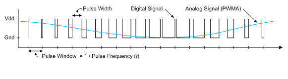
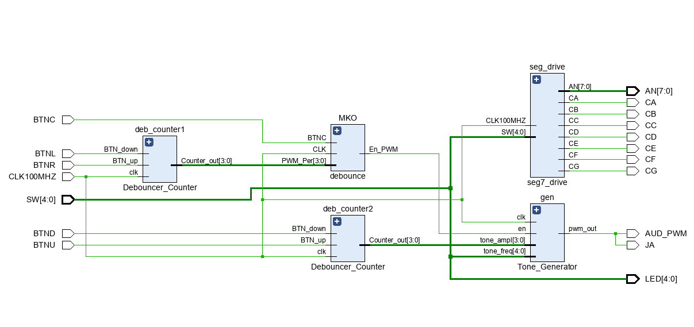
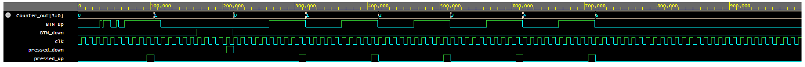
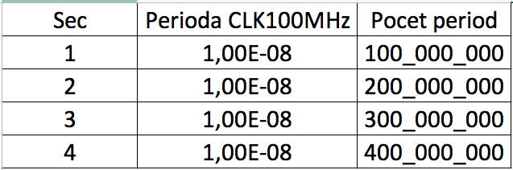
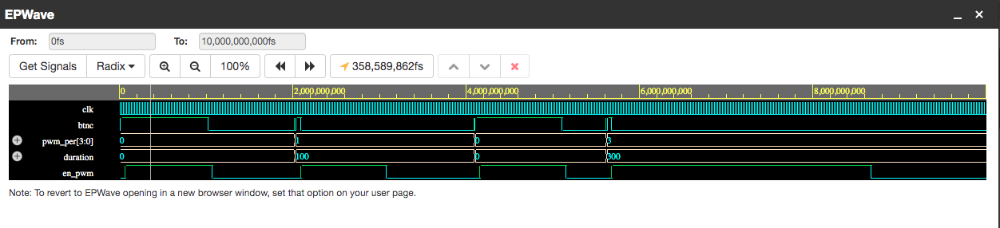
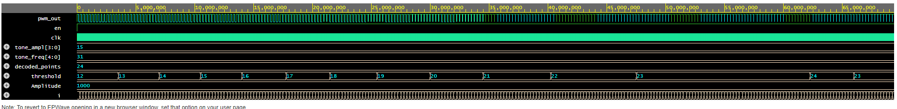

# VHDL project - PWM-Based Tone Generator

### Team members

* Nizamutdinov Artur - debouncer_MKO, 7seg_drive
* Bukva Tomáš - PWM_gen
* Aujeský Filip - debouncer_counter
* Shishkova Viktoriia 

## Teoretický úvod a cíl projektu

Cílem projektu je vytvářeni tónového generátoru a testovaní jeho funkčnosti. Generátor využívá princip Pulzně šířkové modulace, převádějící sinusovou vlnu do tvaru nevzorkovaného signálu obdélníkového tvaru. Negativní pulz odpovídá nižší úroví (Low-level 0), pozitivní pulz odpovídá vyšší úrovní (High-level 1).
 

Níže je představena plna bloková schéma PWM generátoru.
 

## Hardware description of demo application
Použita deska je NexysA7-50T. Audio výstup jack (J8) je připojen k reproduktoru, použivá filtr Sallen-Key Butterworth Low-pass 4th Order dovolujicí mono audio výstup. Digitalní vstup je PWM-signál a je vědený logickou 0 nebo 1. Nizkofrekvenční filtr se na vstupu chová jako rekonstrukční filtr převodu PWM digitalního signálu na analogové napětí na vystupu audio jacku.

#### Aktivní prvky na desce:
- BTNC 

Tlačitko BTNC funguje jako zapináč posílaní signálu do reproduktoru a na schematu má označení START.
Podržením tlačitka BTNC kontrolujeme delku zvučení signálu když "delková "tlačitka jsou v nůle. 
Po nastavéní delky signálu pomocí tlačitek BTNL a BTNR pak zmačknutím spustíme signál a ten bude znět tu dobu, která byla nastavena. 

- BTNL/BTNR

"Tonová" tlačitka BTNL a BTNR fungují tak, že pomocí ně nastavíme delku znění tonu. BTNL ponižuje dobu trvaní tonu o 1 sekundu, BTNR naopak zvetšuje dobu trvaní o 1 sekundu. 

- SWITCHES

Switches mají na stárosti prepinání mezi noty (frekvenci). Binarni kombinaci switchu je moznost nastaveni jednoho z 32 tonu. 
Display je naprogramovan pomoci bloku 7seg. Vybrany ton se zobrazi na displaji cislem a pismenem. Aktivni je indikace pomoci LEDek.

## Softwarove bloky

* Debouncer counter 1/2.

  Bloky jsou shodne ve svem postaveni. Oba bloky maji tri vstupnich signaly (2x BTN- a CLK100 MHz). Jsou rizene klokovacim signalem. Vystup je jedinym signalem Counter_out[3;0]. 
    - deb_counter1 nastavuje dellu trvani dignalu. Je rizeny tlacitkami BTNL, BTNR. Vystupni signal postupuje do bloku MKO. 
    - deb_counter2 nastavuje amplitudu vystupniho signalu. Je rizeny tlacitkami BTND a BTNU. Vystupni signal nasleduje primo do bloku tonoveho generatoru gen. 

 
* MKO - Monostabilni klopny obvod.

 Modul Debounce_MKO implementuje debounce mechanismus pro tlačítko BTNC a také nastavuje dobu trvaní výstupu z generátoru tónu ve stavu High(enable výstup pro generátor En_PWM), tj jak dlouho vybraný tón zní. Modul celkem provádí tři procesy:
 
   1. Debounce mechanismus.
Debounce mechanismus je implementován pomocí stavového automatu, který reaguje na změny vstupního signálu BTNC a provádí odpovídající přechody mezi stavy s použitím časovače.

  
   2. Proces pro řízení výstupního signálu.
Tlačítko BTNC pracuje ve dvou režimech: 
- pokud na vstupu PWM_Per, který určuje dobu trvaní signálu je 0, tlačítko BTNC funguje jako test-tlačítko, to znamená, že signál zní pouze dokud je tlačítko zmačknuto
- pokud na vstupu PWM_Per zvýšíme hodnotu o 1, tlačítko BTNC začíná fungovat jako start-tlačítko a signál na výstupu zní po dobu 1 vteřiny apod.

  3. Proces pro dekódování délky trvaní PWM.
Vstup PWM_Per sleduje stisk tlačítek BTNL a BTNR a nastavuje délku trvání signálu En_PWM podle předem definovaných konstant (1s, 2s, 3s, 4s).
Počet period CLK100MHz = 1 sekunda/10ns = 100_000_000 period.

* Tone_Generator

V bloku tonoveho generatoru probiha generovani signalu. Jsou vybrane 10 hodnot frekvenci. Hodnoty jsou velke aby vzorkovani probehlo v pohode a rozdil tonu bylo lze slyset. Signal se deli na 1024 vzorku a stava z toho PWM signal. Vystup jde do monitoru.
Na vstup PWM generatoru jsou privadeny vystup z MKO, klokovaci signal a vystupy signalu deb_counter1 a deb_counter2. Vystupem je PWM signal do monitoru na AUD_PWM a JA.

  

# 7seg_2digit

Celkový modul pro zobrazení noty(tónu) a oktávy na dva různé displeje je rozdělen na dvě části.

1. Divider je modul, který na vstup note přijímá binární hodnoty z přepínačů SW(4:0). Výstupem jsou dva signály:
seg_out_1(6:0) - signál pro zobrazení noty(tónu) na jeden displej (C, D, E, F, G, A, B) a 
seg_out_2(6:0) - signál pro zobrazení příslušné oktávy na druhý displej (4, 5, 6, 7, 8)

2. Mux je modul, který zobrazuje na displejích příslušná data.
Uvnitř modulu je counter, který každou 1 ms přepíná výstup to_7seg na příslušné hodnoty ze vstupu note_in a oktave_in.
Zároveň se přepíná výstup to_anod_0, který určuje na jaké anodě v daný okamžik má být stav High. 

## Instructions
Instrukce pro použití tónového generátoru na desce NexysA7-50T:

-	Pomocí přepínačů SW nastavte požadovanou notu. Na displeje se zobrazí tón. 
-	Pomocí tlačítek BTNL a BTNR nastavte délku zvuku.
-	Stiskněte tlačítko BTNC pro spuštění generátoru tónů a znění zvolené noty
-	Pomocí tlačítek BTNU a BTND se upravuje hlasitost tónu.

https://youtu.be/3LdDS_pSHGM?si=KPGCeBt3VCl12Sti

## References

1. https://digilent.com/shop/nexys-a7-fpga-trainer-board-recommended-for-ece-curriculum/
2. https://github.com/tomas-fryza/vhdl-course/tree/master?tab=readme-ov-file
3. 
