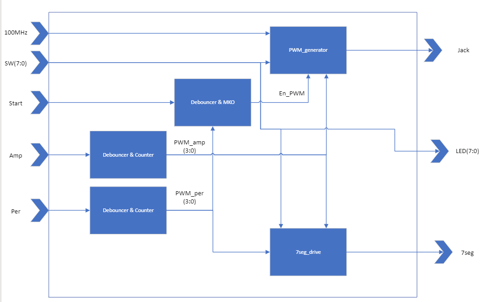

# VHDL project - PWM-Based Tone Generator

### Team members

* 
* 
* 

## Theoretical description and explanation

## Hardware description of demo application
Použita deska je NexysA7-50T. Audio výstup jack (J8) je připojen k reproduktoru, použivá filtr Sallen-Key Butterworth Low-pass 4th Order dovolujicí momo audio výstup. Digitalní vstup je PWM-signál a je vědený logickou 0 nebo 1. Nizkofrekvenční filtr na vstupu chova se jako rekonstrukční filtr převodu PWM digitalního signálu na analogové napětí na vystupu audio jacku.

#### Aktivní prvky na desce:
- BTNC 

Tlačitko BTNC funguje jako zapináč posílaní signálu do reproduktoru a na schematu má oynačení START.
Podržením tlačitka BTNC kontrolujeme delku zvučení signálu když "delková "tlačitka jsou v nůle. 
Po nastavéní delky signálu pomocí tlačitek BTNL a BTNR pak zmačknutím spustíme signál a ten bude znět tu dobu, která byla nastavena. 

- BTNL/BTNR

"Tonová" tlačitka BTNL a BTNR fungují tak, že pomocí ně nastavíme delku znění tonu. BTNL ponižuje dobu trvaní tonu o 1 sekundu, BTNR naopak zvetšuje dobu trvaní o 1 sekundu. 

- SWITCHES

Switche mají na stárosti prepinání mezi noty (frekvenci).
Každý switch je zodpovědní za určitou frekvenci:
  - Do = 262 Hz => SW0 (J15)
  - Re = 294 Hz => SW1 (L16)
  - Mi = 330 Hz => SW2 (M13)
  - Fa = 349 Hz => SW3 (R15)
  - Sol = 392 Hz => SW4 (R17)
  - La = 440 Hz => SW5 (T18)
  - Si = 494 Hz => SW6 (U18)

## Software description

### Component(s) simulation

* 

* 

* 

* 

* 

*
## Instructions

Write an instruction manual for your application, including photos or a link to a video.

## References

1.
2. 
3. 
